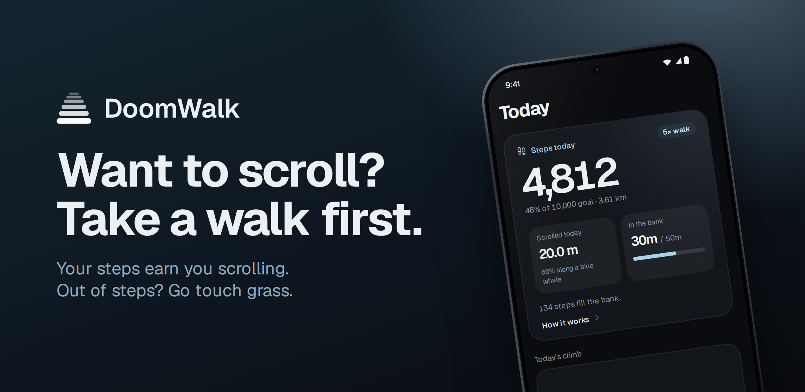
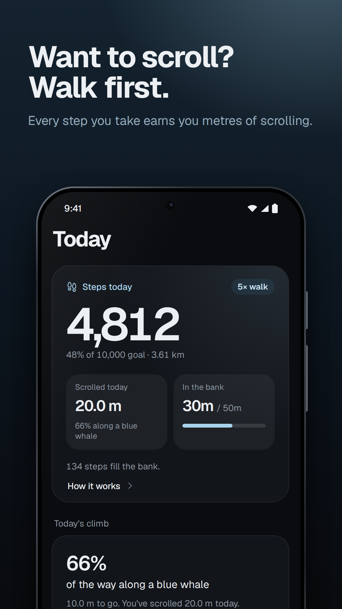
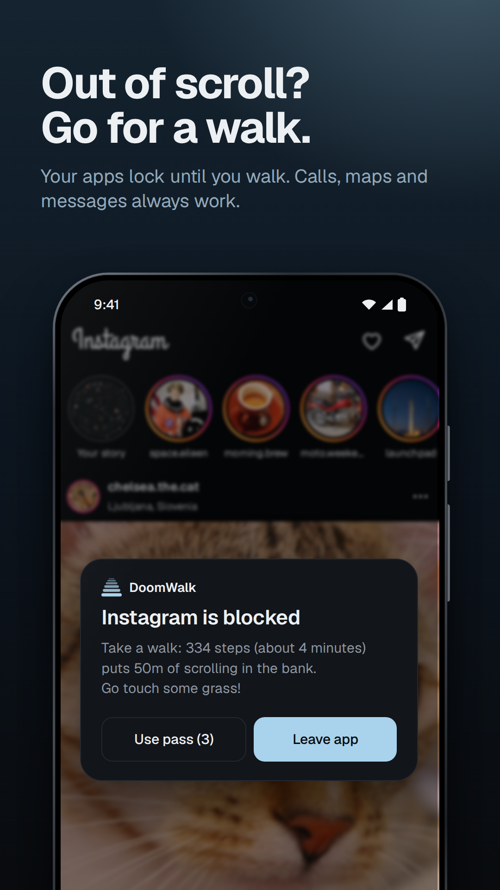
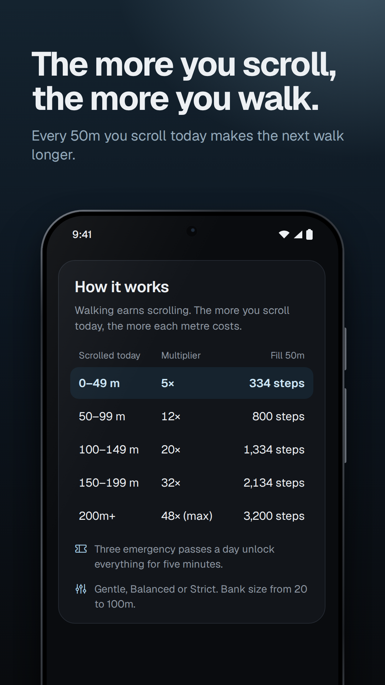
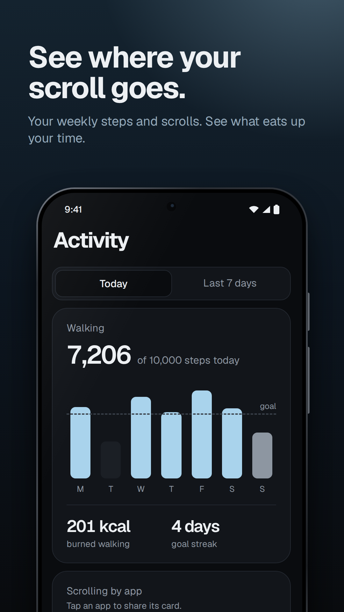
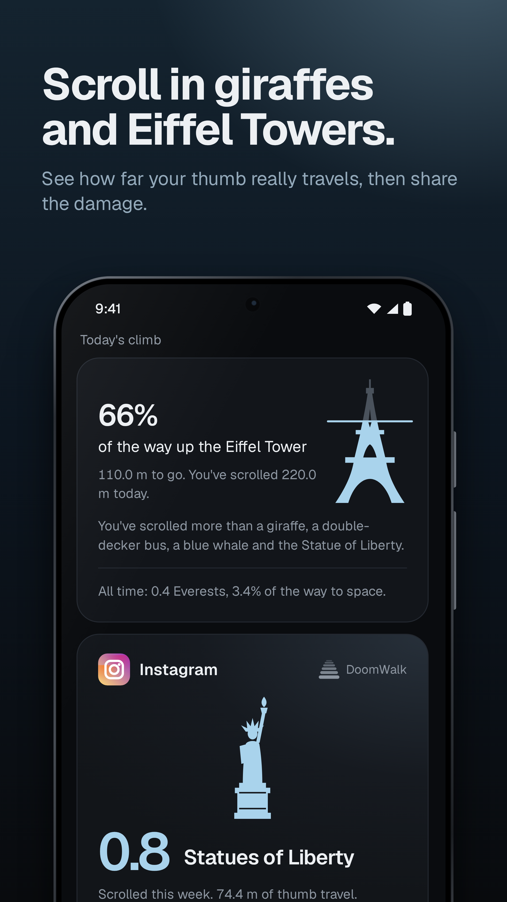

  

<h1>&nbsp;&nbsp;DoomWalk</h1>

A step counter for Android that fights back.
 
Winning project at <a href="https://hackchalmers.se/">Hack Chalmers</a>. Built in under 24h.

DoomWalk makes you walk before you can doomscroll. It measures how far you scroll in
your social and video apps, in actual metres, and only lets you scroll as far as
you've walked. Run out, and all addicting apps are blocked until you get up and touch some grass.

  
  
  
  
  

## How it works

1. **Walking earns you scrolling.** Every day starts with 0m, and you can save up to 50m of scrolling at a time. Walking while your balance is full does nothing, so walk when you want to scroll.
2. **Scrolling drains you balance.** Apps like Instagram, TikTok, YouTube and Reddit use it up, but apps like calls, maps, banking, messages and emergency apps do not.
3. **Scrolling gets more expensive.** Every metre of scrolling costs you 5m of walking to start with, and it goes up a tier for every 50m you scroll in a day:

   | Scrolled today | Walking per metre | Earning the full 50m |
   |---|---|---|
   | 0–49m | 5× | 334 steps |
   | 50–99m | 12× | 800 steps |
   | 100–149m | 20× | 1,334 steps |
   | 150–199m | 32× | 2,134 steps |
   | 200m and more | 48× (max) | 3,200 steps |

4. **Out of scrolling? Apps are blocked, time to touch grass.** It fades behind a blur with a card that says how many steps get you going again. Taps still work, it's just no fun.
5. **Need a dopaime hit badly?** Three emergency passes a day unlock everything for five minutes.

Prefer it gentler or stricter? You can pick between *Gentle*, *Balanced* or *Strict* modes in Settings and set how much scrolling you can save up, anywhere from 20 to 100m.

## Features

* **Today at a glance:** your steps, how much scrolling you have left, and what walking costs now.
* **Activity:** steps against your daily goal (10,000 by default), a week of walking, your streak, and which apps eat the most of your time.
* **Landmarks:** your scrolling measured in giraffes, Eiffel Towers and Everests, with a card to share (`#DoomWalk`).
* **A  notification** with the scrolling you have left and an emergency-pass button and **a home-screen widget** with your scrolling left or the steps you need.

## Privacy

DoomWalk has no internet permission and collects 0 personal data. Nothing ever leaves your phone.
It needs Android's accessibility access to notice scrolling, but it can only see how far you scroll and which app is open, not the actual content of the screen.

## Getting it

Currently only available on Android 13+ because of the accessibility requirements.
 
Soon available for download from the Google Play Store, until then you can download the APK from the [latest release](https://github.com/lebaaar/doomwalk/releases/latest).

To build it yourself, see [CONTRIBUTING.md](CONTRIBUTING.md).
