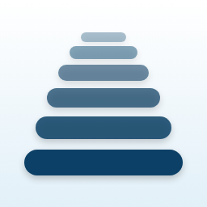
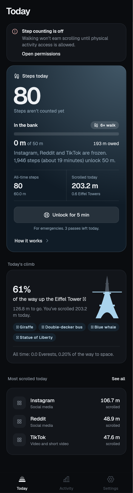
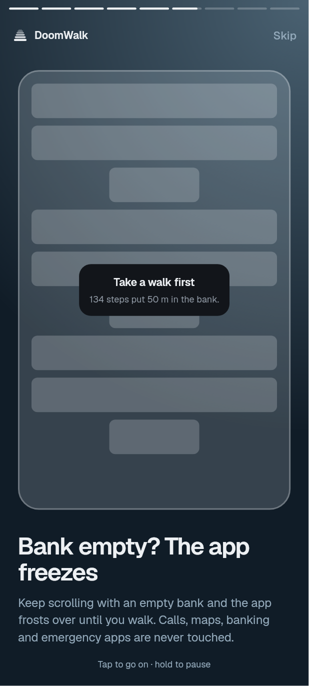
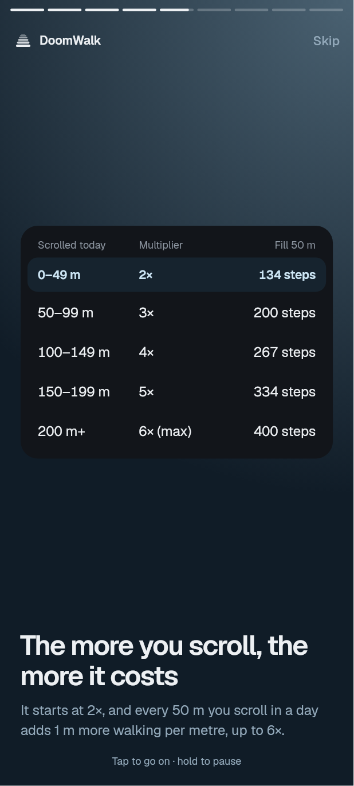
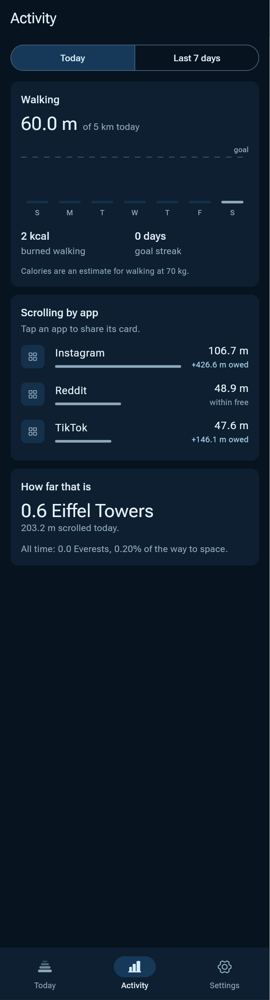
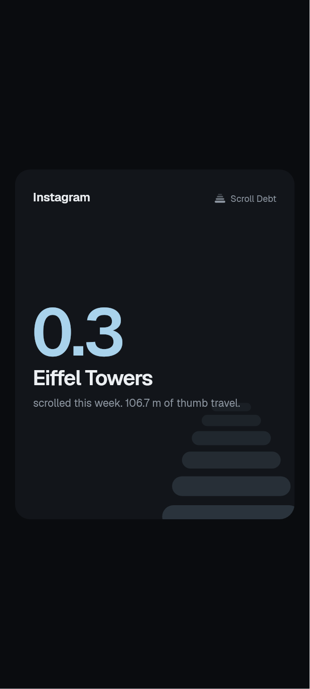

  

<h1 align="center">DoomWalk</h1>

<b>Want to scroll? Take a walk first.</b>

For Android · everything stays on your phone · no accounts, no ads, no tracking

---

DoomWalk turns walking into scrolling. It measures how far you scroll in your social
and video apps, in real **metres**, and only lets you scroll as far as you've walked.
Run out, and the app you're in slowly **frosts over** until you get up and take a walk.

  
  
  

## How it works

1. **Walking fills a small bank.** It starts empty every morning and holds 50 m of
   scrolling. Walking while it's full adds nothing, so walk when you want to scroll.
2. **Scrolling spends it.** Instagram, TikTok, YouTube, Reddit and the like count.
   Calls, maps, banking, messages and emergency apps are never touched.
3. **Scrolling gets more expensive.** At first every metre of scrolling costs 2 m of
   walking. The more you scroll in a day, the more each metre costs:

   | Scrolled today | Walking per metre | Filling the 50 m bank |
   |---|---|---|
   | 0–49 m | 2× | 134 steps |
   | 50–99 m | 3× | 200 steps |
   | 100–149 m | 4× | 267 steps |
   | 150–199 m | 5× | 334 steps |
   | 200 m and more | 6× | 400 steps |

4. **Bank empty? The app freezes.** It fades behind a blur with a card that says how
   many steps get you going again. Taps still work, it's just no fun.
5. **Emergencies happen.** Three passes a day unlock everything for five minutes.
6. **Every midnight is a fresh start.** The bank empties and prices go back down.

Prefer it gentler or stricter? Pick **Gentle**, **Balanced** or **Strict** in Settings,
and set the bank anywhere from 20 to 100 m.

## Features

* **Today at a glance:** your steps, how full the bank is, and what walking costs now.
* **A story-style intro** that explains it all in a minute, any time from Settings.
* **Activity:** steps against your daily goal (10,000 by default), a week of walking,
  your streak, and which apps you scroll most.
* **Landmarks:** your scrolling measured in giraffes, Eiffel Towers and Everests, with
  a card to share (`#DoomWalk`).
* **Notification and home-screen widget** with what's left in the bank and an
  emergency-pass button.
* **Light and dark mode.**

  
  
  

## Privacy

DoomWalk has **no internet permission**: nothing ever leaves your phone. It needs
Android's accessibility access to notice scrolling, but it can only see **how far** you
scroll and **which app** is open, never what's on the screen. Your data is not included
in cloud backups.

## Getting it

DoomWalk isn't in an app store yet. To build and install it yourself, see
[CONTRIBUTING.md](CONTRIBUTING.md).

**Why "DoomWalk"?** Doomscrolling plus a walk: the walk is the ticket, the scroll is
the ride. It's written **DoomWalk**, one word with a capital W.
