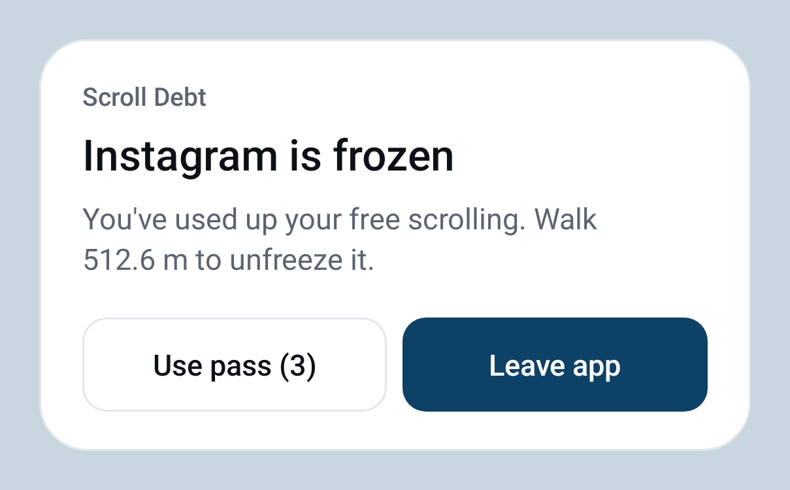

<p align="center">
  
</p>

<h1 align="center">DoomWalk</h1>

<p align="center"><b>Want to scroll? Take a walk first.</b></p>

<p align="center">
  Android 12+ · Flutter · fully on-device · no INTERNET permission · no analytics
</p>

---

Every flick of your thumb has a distance. DoomWalk measures how far you scroll, in
**metres**, across your social and video apps. Walking fills a **bank** of scrolling and
scrolling spends it. The bank starts empty every day and holds 250 m, so you walk when
you want to scroll. Run out and the app you're in **frosts over** until you take a walk.

| You walk | You scroll | It frosts |
|---|---|---|
| Walking fills the bank, up to 250 m. At first 1 m walked adds 1 m of scrolling; the more you scroll in a day, the more walking each metre takes. | Scrolling spends the bank. | With the bank empty, the app fades behind a blur and says how many steps put 100 m back in it. Touches still work, but it's no fun. |

<p align="center">
  
  
  
</p>

**Why "DoomWalk"?** Doomscrolling plus a walk: the walk is the ticket, the scroll is
the ride. The name comes with a hashtag for the share card: `#DoomWalk`.

**Brand basics:** the name is written **DoomWalk**, one word with a capital W. The
mark is a stack of frost-blue *depth ticks* (see [docs/logo](docs/logo/README.md)).
Package id: `com.lebaaar.doomwalk`.

## Install (Fedora)

```bash
# Tools
sudo dnf install android-tools git unzip java-21-openjdk-devel
# Flutter SDK
git clone https://github.com/flutter/flutter.git -b stable ~/flutter
echo 'export PATH="$HOME/flutter/bin:$PATH"' >> ~/.bashrc && source ~/.bashrc
# Android SDK: install Android Studio (Flathub: com.google.AndroidStudio) or the
# command-line tools, then:
flutter doctor --android-licenses
flutter doctor
```

Enable USB debugging on the phone: Settings → About phone → tap *Build number* 7× →
back to Settings → System → Developer options → **USB debugging** on. Plug in, accept
the RSA prompt, then check that `adb devices` lists the phone. On Fedora, if it shows
`no permissions`: `sudo dnf install android-udev-rules` and re-plug.

```bash
flutter pub get
flutter build apk --debug && adb install -r build/app/outputs/flutter-apk/app-debug.apk
# release (no INTERNET permission):
flutter build apk --release
```

## Release build

A release build is optimised (no debug banner or slow debug checks), has no
INTERNET permission, no adb debug hooks and no `SD` logging. Sign it with your
own key so later releases can update it in place.

1. Create a key once and keep it safe (back it up: without it you can't ship
   updates to the installed app):
   ```bash
   keytool -genkey -v -keystore ~/doomwalk-upload.jks -keyalg RSA -keysize 2048 \
     -validity 10000 -alias upload
   ```
2. Create `android/key.properties` (git-ignored, never commit it):
   ```properties
   storePassword=<the password you chose>
   keyPassword=<the password you chose>
   keyAlias=upload
   storeFile=/home/<you>/doomwalk-upload.jks
   ```
3. Raise `version:` in `pubspec.yaml` for every release (`1.0.1+2`: the number
   after `+` must go up, or Android refuses the update).
4. Build and install:
   ```bash
   flutter build apk --release
   adb install -r build/app/outputs/flutter-apk/app-release.apk
   # or, for Google Play:
   flutter build appbundle --release   # build/app/outputs/bundle/release/app-release.aab
   ```
5. Check it: `aapt2 dump permissions build/app/outputs/flutter-apk/app-release.apk`
   must not list `android.permission.INTERNET`.

Without `key.properties` the release build is signed with the debug key. It
runs, but it can't update (or be updated by) an APK signed with your real key:
uninstall first, which erases the app's data. The first install of a properly
signed build over a debug one needs that uninstall too.

A sideloaded release APK needs *Allow restricted settings* before Android lets
you turn on the accessibility service (see Permissions).

## Permissions

The onboarding screen walks through each one with a deep link and a live tick:

| Step | Where | adb shortcut |
|---|---|---|
| Restricted settings (Android 13+, sideloaded) | App info → ⋮ → *Allow restricted settings* | `adb shell appops set com.lebaaar.doomwalk ACCESS_RESTRICTED_SETTINGS allow` |
| Scroll measuring (accessibility) | Settings → Accessibility → DoomWalk | `adb shell settings put secure enabled_accessibility_services com.lebaaar.doomwalk/com.lebaaar.doomwalk.ScrollAccessibilityService` and `adb shell settings put secure accessibility_enabled 1` |
| Physical activity | permission dialog | `adb shell pm grant com.lebaaar.doomwalk android.permission.ACTIVITY_RECOGNITION` |
| Notifications | permission dialog | `adb shell pm grant com.lebaaar.doomwalk android.permission.POST_NOTIFICATIONS` |
| Battery optimisation | system dialog | `adb shell dumpsys deviceidle whitelist +com.lebaaar.doomwalk` |

**Privacy:** the accessibility service sets `canRetrieveWindowContent="false"` and only
subscribes to scroll and window-state events. It reads scroll geometry and the package
name, never screen content.

## Automated device check

```bash
./tool/device_test.sh          # SCROLL_APP=com.instagram.android SWIPES=120 to change target
```
It installs, grants everything, enables the service, swipes, screenshots the frost,
tests tap-through, exempt apps, swipe-from-recents survival, walk-off (debug hook) and
persistence, and checks the release APK for INTERNET. The results go to `docs/device/`.

Debug-only adb hooks (absent from release builds):
```bash
adb shell am broadcast -n com.lebaaar.doomwalk/.DebugReceiver -a com.lebaaar.doomwalk.DEBUG_SCROLL --es pkg com.instagram.android --ef metres 10
adb shell am broadcast -n com.lebaaar.doomwalk/.DebugReceiver -a com.lebaaar.doomwalk.DEBUG_WALK --ef metres 25
adb shell am broadcast -n com.lebaaar.doomwalk/.DebugReceiver -a com.lebaaar.doomwalk.DEBUG_DUMP
adb logcat -s flutter | grep 'SD '
```

## Demo script (under 2 minutes)
1. Before going on stage: the app is installed and onboarded, cross-window blur is on
   (Developer options → *Allow window-level blurs*, normally on by default), and
   battery saver is **off** because it disables blur.
2. Start with an empty bank: DoomWalk → ⚙ → Developer options → *Reset tracking*.
3. Open Instagram and scroll the feed. The bank is empty, so the frost fades in
   within a few dozen flicks (full at 20 m owed), with a "Take a walk" card in the
   middle. Tap a post to show that touches still work through the frost.
4. Pull down the notification: "Frozen. Walk x steps to unlock 100 m", with the
   **Emergency pass** button.
5. Open DoomWalk: the *Today* card turns navy, with the bank empty, what's owed and
   the steps to walk, and Instagram is at the top of *Most scrolled today*.
6. Walk about 30 steps around the stage. What's owed counts down and back in
   Instagram the frost melts. (Backup: Settings → Developer options → *Add steps to today*.)
7. *Activity* → *Scrolling by app* → tap Instagram → **Share** for the
   "Instagram: … this week" card.

## Model
A bank of scrolling, reset at local midnight:

1. **Starts empty.** Every day begins with 0 m in the bank.
2. **Walking fills it, up to a cap** (250 m by default, 50-500 m in Settings → Bank).
   Walking while it's full counts for nothing, so a long commute can't buy a day of
   scrolling.
3. **Rising price:** a metre walked adds `1 / price` metres of scrolling, where
   `price = min(maxPrice, 1 + floor(scrolledToday / priceStep))`. Balanced: +1 every
   100 m scrolled, up to 5:1.
4. **Scrolling spends it.** With the bank empty, scrolling is owed and the frost grows
   with it, full at 20 m owed. Walking pays what's owed first, then fills the bank.
5. **Passes:** 3 a day, 5 minutes each. Scrolling during a pass costs nothing and
   doesn't raise the price.
6. **Midnight:** bank, what's owed and the price all start over. No interest.

| Preset | Price +1 every | Cap |
|---|---|---|
| Gentle | 200 m | 3:1 |
| Balanced | 100 m | 5:1 |
| Strict | 50 m | 5:1 |

The bank size is its own setting, independent of the preset. Tracking gaps
(accessibility switched off, app force-stopped) are charged as scrolling at your
average rate, from the bank first. The reasoning is in [DECISIONS.md](DECISIONS.md),
plugin findings in [SPIKE.md](SPIKE.md), and status in [PROGRESS.md](PROGRESS.md).

## Layout
```
lib/core/       pure Dart (no Flutter): ScrollWallet, units, ScrollInterpreter,
                landmarks, AppCatalog, presets, tamper, WalkTracker
lib/services/   controller (orchestration), sqflite store, native bridge
lib/ui/         dashboard, altitude gauge, onboarding, settings, share card
android/.../DoomWalkShim.kt   accessibility service, frost overlay, FGS, engine host
android/.../DebtWidget.kt       home-screen widget providers (2×1, 4×2)
android/app/src/debug/          debug-only adb hooks
test/           unit + pipeline + render tests
```
