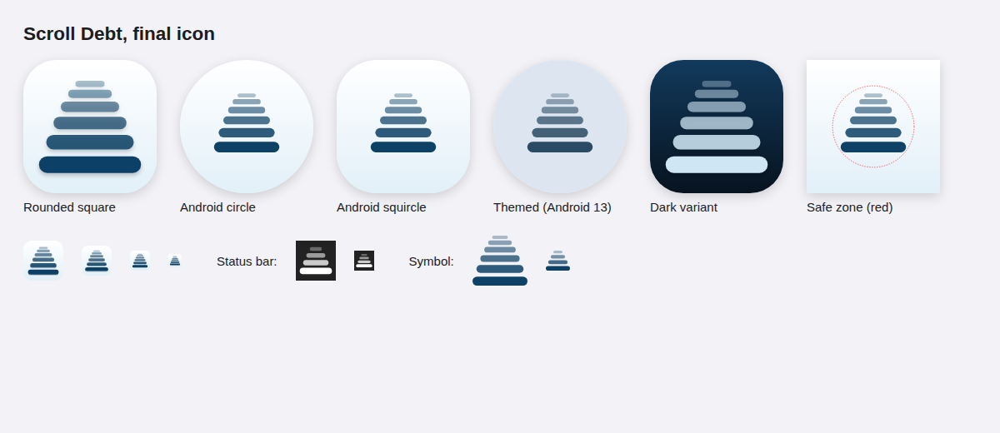

# DoomWalk logo

The mark is a stack of **depth ticks**: six rounded bars that get wider, thicker
and more solid as they go down, so the feed seems to come towards you out of the
depth. It was picked from six rounds of concepts (`concepts-round*.png`); the
final one is round 6, option 3, "Frost".

## Files (`final/`)

| File | Use |
|---|---|
| `icon.svg` | App icon and store artwork: white to frost-blue background, navy ticks, soft shadow |
| `icon-flat.svg` | Same without the shadow filter, for tools that don't support filters |
| `icon-dark.svg` | The mark inverted (frost ticks on deep navy) for dark contexts |
| `symbol.svg`, `symbol-white.svg`, `symbol-black.svg` | The ticks alone, transparent, cropped tight |
| `symbol-small.svg` | Four fatter ticks, for 16 to 24 px (tab bar, notification icon) |
| `png/` | `icon-16` to `icon-1024`, `play-store-512`, `icon-dark-512/1024`, `symbol(-white)-64` to `-1024` |

`final/build.py` writes the SVGs and the Android resources (adaptive icon
foreground, background and monochrome layers, the `ic_stat_ticks` notification
icon). It asserts that the adaptive mark stays inside the 66 dp safe circle.
`final/export.cjs` renders every PNG, the legacy `mipmap-*/ic_launcher.png` and
`final-icon.png` with Chromium. Flutter draws the same geometry in
`lib/ui/logo.dart` (`DepthTicks`).

## Colours

| | Hex | Use |
|---|---|---|
| Navy | `#0E4166` | The ticks; the app's accent in light mode |
| Frost | `#E2F0F8` | Background gradient end; tonal fills |
| White | `#FFFFFF` | Background gradient start |
| Deep navy | `#07131F` | Dark mode background |
| Frost blue | `#A9D3EC` | Dark mode accent and ticks |

Two colours only: the lighter ticks are the same navy at lower opacity
(32 % to 100 %), never a third colour.

## Rules

* **Clear space:** at least the height of the bottom tick on every side.
* **Minimum size:** the six-tick mark down to 32 px; below that use
  `symbol-small.svg`.
* **Don't** recolour individual ticks, add an accent tick, outline the ticks,
  stretch the stack, or put the navy mark on a dark background (use the dark
  variant instead).
